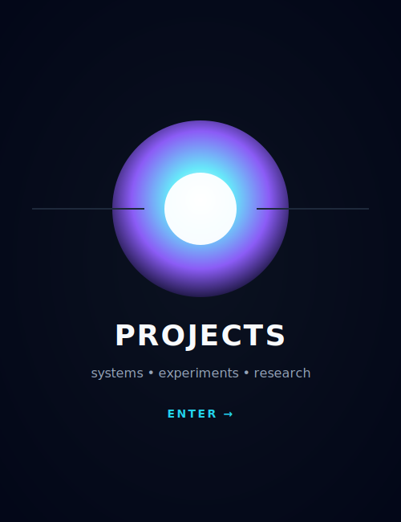

  

<h3 align="center">
Electrical Engineering Student
</h3>

Sensing • Control Systems • Embedded Systems • AI

# Engineering Tools & Projects

<table border="0" cellspacing="10" cellpadding="0">
<tr>

<!-- LEFT: TOOLS -->
<td width="420" valign="top" align="center">

<h3>🛠 Engineering Tools </h3>
 

<table align="center" cellspacing="0" cellpadding="8">
  <tr>
    <td align="center">
       C
    </td>
    <td align="center">
       Python
    </td>
    <td align="center">
       TensorFlow
    </td>
    <td align="center">
       JavaScript
    </td>
  </tr>

  <tr>
    <td align="center">
       MATLAB
    </td>
    <td align="center">
       Siemens LOGO!
    </td>
    <td align="center">
      
    </td>
    <td align="center">
       
    </td>
  </tr>
  <tr>
  <td align="center">
     Anaconda
  </td>

  <td align="center">
     VS Code
  </td>

  <td align="center">
    
  </td>
  </tr>
  
</table>

</td>

<!-- PROJECTS -->
<td width="420" valign="top" align="center">

<h3>🧪 Projects</h3>
 

  

</td>

</tr>
</table>

